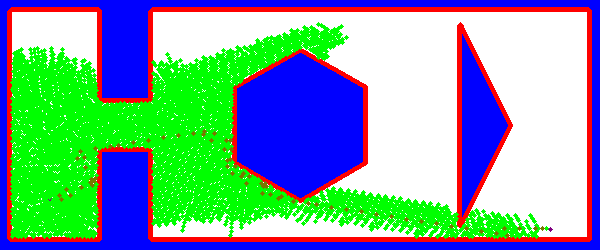

# Project 3 - ENPM 661 - Planning for Autonomous Robotics

# A_star_turtlebot
This submission is for project 3 phase 2 part 02 and part01

Implementation of the A star Algorithm for a Turtlebot Robot with non holonomic constraints 

<ins>Team members

Neha Marne: nmanrne: 119400210
  
Anukriti Singh: anukriti: 119288306

<ins>Required libraries 
  
 time, copy, opencv (4 and above), numpy, math and heapq


<ins>Code
  
Run code ```'roslaunch <package-name> <launch-file> <x_pos> <y_pos> <z_pos>'``` 


Enter the start position and goal position coordinate values as integers and you can also change the ```manual_input = False```


<ins>Output 

The final output is the video generated and saved on the system and it prints the total run time

<ins>Test case 1 
  
Start and Goal positions - (50,50) and (550,220)

The video can be found here for PART 01 - [Link](https://drive.google.com/file/d/19alkcWQ6fVwDSAHpjWoOZecZYX_5Wq0_/view?usp=sharing)

The video can be found here for PART 02 - [Link](https://drive.google.com/file/d/1Q98o7i68HYg8tW1OrIliwXY8RNIkUW-U/view?usp=sharing)

Initial head angle - 0

Clearance - 5, rpm1 - 2 and rpm2 - 4

Total time - 7s


<ins>Test case 2 
  
Start and Goal positions - (50,50) and (550,20)

The video can be found here for Part 01- [Link](https://drive.google.com/file/d/1SLQjZbixjfkc9F1XBual4tVOsbaBF0dG/view?usp=sharing)

The video can be found here for Part 02- [Link](https://drive.google.com/file/d/1SLQjZbixjfkc9F1XBual4tVOsbaBF0dG/view?usp=sharing)

Initial head angle - 0

Clearance - 5, rpm1 - 2 and rpm2 - 4

Total time - 7.8s


